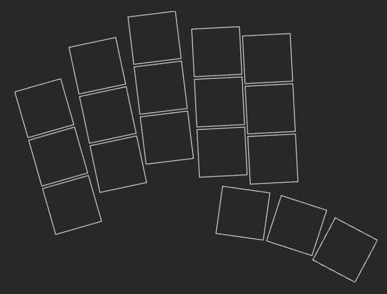

I'd like to create a small application that can run in the browser that can be used to create keyboard    
layout tours. For the time being, there will be no database - each keyboard that I want to create a tour  
for, I'll define in a set of config files in a separate directory. So this app could be considered        
something like a site generator - as input it takes a `src/keyboards/` directory with one or more         
subdirectories for each keyboard. As an output it creates a set of HTML/Javacript pages that provide      
'tours' for the keyboard layouts of each of the keyboards.                                                
                                                                                                          
For the actual javascript/typescript, I'd like to use svelte. For any Css use tailwind. For package       
management, use pnpm.                                                                                     
                                                                                                          
As a first feature, for each keyboard I'd like to be able to provide a keys.yaml file, which defines the physical location of the keys on the keyboard, using the same syntax used by ergogen. So for example it might look like the yaml in `src/keyboards/paw/keys.yaml`.

For each keyboard defined in the `src/keyboards` directory, the app should generate a page/route in the application that shows a tour of that keyboard. Initially (for the first feature) that page will simply render a graphical representation of the keyboard based on the ergogen configuration.... so something like .

Later (once we have that working) we can iterate to add new features to the app.